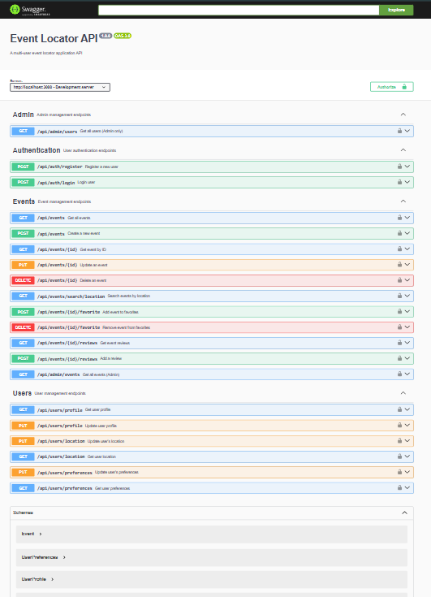
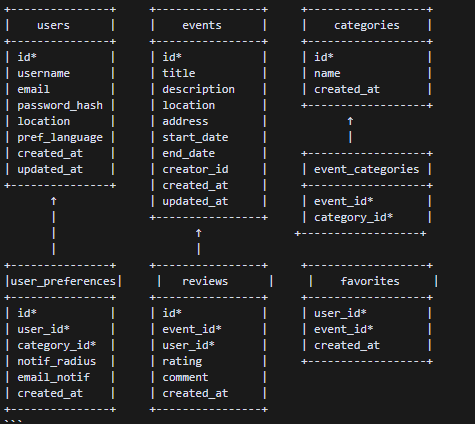
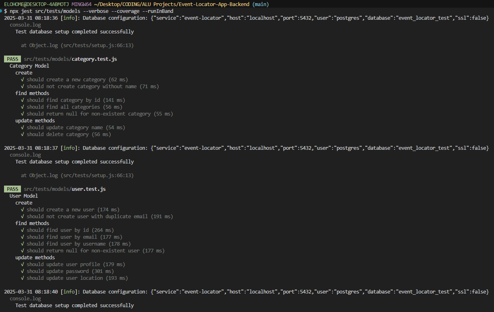
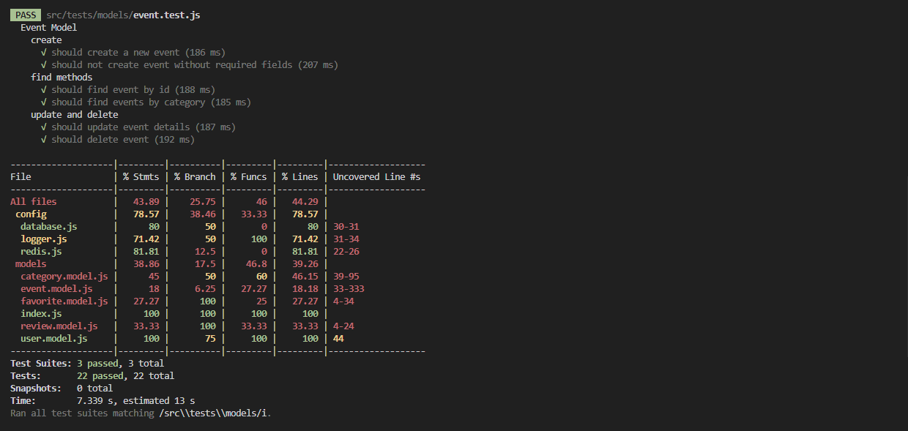

# Event Locator Application

A multi-user event locator application allowing users to discover events based on location and preferences, built with Node.js, Express, PostgreSQL, and Redis.



## Features

- **User Management**
  - Secure user registration and login with JWT authentication
  - User profiles with location preferences
  - Category-based event preferences
  - Multi-language support

- **Event Management**
  - Create, read, update, and delete events
  - Geospatial search capabilities
  - Category-based filtering
  - Event ratings and reviews
  - Favorite events system

- **Location Services**
  - PostGIS-powered location search
  - Radius-based event discovery
  - Google Maps integration
  
- **Real-time Features**
  - Event notifications via email
  - Redis-based message queuing
  - WebSocket updates for event changes

## Challenges Faced & Solutions

During development, several significant challenges were encountered and successfully addressed:

1. **Database Integration**: The most critical challenge was implementing geospatial features with PostgreSQL and PostGIS. This was solved by properly configuring the database with PostGIS extensions and implementing robust connection pooling with error handling. The solution included transaction management for data consistency and proper indexing for performance optimization.

2. **Authentication System**: Implementing a secure authentication system with JWT tokens and role-based access control presented challenges. This was resolved by implementing a comprehensive auth service with proper password hashing, token generation, and role validation.

3. **Real-time Features**: Building real-time features with WebSocket and Redis for notifications was complex. The solution involved implementing a robust WebSocket server with proper connection handling and a Redis-based queue system for reliable message delivery.

4. **Testing Environment**: Setting up a proper testing environment with separate test databases and mocked external services was challenging. This was addressed by creating comprehensive test setup scripts and implementing proper environment separation.

5. **Error Handling**: Managing errors across different layers of the application required careful consideration. The solution included implementing a centralized error handling system with proper logging and user-friendly error messages.

## Technologies Used

The technology stack was carefully chosen to address specific requirements and challenges:

- **Backend**: Node.js with Express.js
  - Chosen for its non-blocking I/O model, perfect for handling concurrent connections
  - Express.js provides a robust middleware system for handling authentication, validation, and error handling
  - Excellent ecosystem of packages for all required functionalities

- **Database**: PostgreSQL with PostGIS
  - PostgreSQL was selected for its robust ACID compliance and reliability
  - PostGIS extension enables efficient geospatial queries and location-based features
  - Supports complex queries for finding events within specific radiuses and locations
  - Built-in support for JSON data types for flexible category storage
  - Excellent performance with large datasets and complex spatial queries

- **Authentication**: JWT, Passport.js, bcrypt
  - JWT for stateless authentication, reducing database load
  - Passport.js provides flexible authentication strategies
  - bcrypt for secure password hashing with salt rounds
  - Enables role-based access control for different user types

- **Validation**: express-validator
  - Provides comprehensive input validation
  - Built-in sanitization to prevent XSS attacks
  - Custom validation rules for complex data structures
  - Seamless integration with Express.js

- **Internationalization**: i18next
  - Supports multiple languages for global user base
  - Dynamic language switching without page reload
  - Efficient translation management
  - Built-in fallback mechanisms

- **Queue System**: Redis
  - Handles background tasks and notifications
  - Provides pub/sub functionality for real-time updates
  - Caching layer for frequently accessed data
  - Reliable message delivery for notifications

- **Testing**: Jest
  - Fast and reliable test runner
  - Built-in mocking capabilities
  - Excellent async testing support
  - Snapshot testing for UI components

- **Logging**: Winston
  - Structured logging with multiple transport options
  - Different log levels for development and production
  - Easy integration with monitoring tools
  - Performance impact monitoring

- **Email**: Nodemailer
  - Reliable email delivery
  - Support for multiple email providers
  - HTML and text email templates
  - Attachment handling

- **Real-time**: WebSocket
  - Enables instant updates for event changes
  - Efficient bi-directional communication
  - Low latency for real-time features
  - Automatic reconnection handling



## Prerequisites

- Node.js (v14 or higher)
- PostgreSQL (v12 or higher) with PostGIS extension
- Redis
- Gmail account (for notifications)

## Installation

1. Clone the repository:
   ```bash
   git clone https://github.com/Chidera0001/Event-Locator-App-Backend
   cd Event-Locator-App-Backend
   ```

2. Install dependencies:
   ```bash
   npm install
   ```

3. Create a `.env` file based on `.env`:
   ```bash
   cp .env .env
   ```

4. Update the `.env` file with your credentials:
   ```env
   # Server
   PORT=3000
   NODE_ENV=development

   # Database
   DB_HOST=localhost
   DB_PORT=5432
   DB_USER=postgres
   DB_PASSWORD=your_password
   DB_NAME=event_locator
   DB_SSL=false

   # Authentication
   JWT_SECRET=your_jwt_secret
   JWT_EXPIRES_IN=7d

   # Redis
   REDIS_HOST=localhost
   REDIS_PORT=6379
   REDIS_PASSWORD=

   # Email
   SMTP_HOST=smtp.gmail.com
   SMTP_PORT=587
   SMTP_USER=your.email@gmail.com
   SMTP_PASSWORD=your_app_password

   # Google Maps
   GOOGLE_MAPS_API_KEY=your_google_maps_api_key
   ```

5. Create the database and enable PostGIS:
   ```sql
   CREATE DATABASE event_locator;
   \c event_locator
   CREATE EXTENSION postgis;
   ```

6. Run database migrations:
   ```bash
   npm run migrate
   ```

7. Start the server:
   ```bash
   npm run dev    # Development mode
   npm start      # Production mode
   ```




## API Documentation

### Authentication

- `POST /api/auth/register`: Register a new user
- `POST /api/auth/login`: Login and get JWT token

### User Profile

- `GET /api/users/profile`: Get current user profile
- `PUT /api/users/profile`: Update user profile
- `PUT /api/users/password`: Update password
- `GET /api/users/location`: Get user location
- `PUT /api/users/location`: Update user location
- `GET /api/users/preferences`: Get user category preferences
- `PUT /api/users/preferences`: Update user category preferences
- `GET /api/users/favorites`: Get user favorite events

### Events

- `POST /api/events`: Create a new event
- `GET /api/events`: Get list of events
- `GET /api/events/:id`: Get event details
- `PUT /api/events/:id`: Update an event
- `DELETE /api/events/:id`: Delete an event
- `GET /api/events/search/location`: Search events by location
- `GET /api/events/category/:id`: Get events by category
- `POST /api/events/:id/favorite`: Add event to favorites
- `DELETE /api/events/:id/favorite`: Remove event from favorites
- `POST /api/events/:id/reviews`: Add a review for an event
- `GET /api/events/:id/reviews`: Get reviews for an event

### Categories

- `GET /api/categories`: Get all categories
- `GET /api/categories/:id`: Get category details

## Permission Levels & Access Control

### Public (No Authentication)
- View all events
- View single event details
- Search events by location
- View events by category
- View event reviews
- Register new account
- Login to existing account
- Access API documentation
- Check server health status

### Authenticated Users
All public permissions, plus:
- Create new events
- Update their own events
- Delete their own events
- Add events to favorites
- Remove events from favorites
- View their favorite events
- Add reviews to events
- Update their profile
- Change password
- Set location preferences
- Manage notification settings

### Admin Users
All authenticated user permissions, plus:
- View all users
- Update any user's status
- Delete users
- View all events with detailed information
- Update any event
- Delete any event
- Update event status (active/cancelled/completed)
- Manage categories
- View system statistics
- Access admin dashboard

## API Endpoints by Permission Level

### Public Endpoints
```bash
# Authentication
POST   /api/auth/register
POST   /api/auth/login

# Events
GET    /api/events                    # List all events
GET    /api/events/{id}              # Get event details
GET    /api/events/search/location    # Search by location
GET    /api/events/category/{id}      # Get events by category
GET    /api/events/{id}/reviews       # Get event reviews

# Categories
GET    /api/categories               # List all categories
```

### Authenticated User Endpoints
```bash
# Event Management
POST   /api/events                    # Create event
PUT    /api/events/{id}              # Update own event
DELETE /api/events/{id}              # Delete own event

# Favorites
POST   /api/events/{id}/favorite      # Add to favorites
DELETE /api/events/{id}/favorite      # Remove from favorites
GET    /api/events/user/favorites     # Get user's favorites

# Reviews
POST   /api/events/{id}/reviews       # Add review

# User Profile
GET    /api/users/profile            # Get profile
PUT    /api/users/profile            # Update profile
PUT    /api/users/password           # Change password
GET    /api/users/preferences        # Get preferences
PUT    /api/users/preferences        # Update preferences
```

### Admin Endpoints
```bash
# User Management
GET    /api/admin/users              # Get all users
PUT    /api/admin/users/{id}         # Update user
DELETE /api/admin/users/{id}         # Delete user

# Event Management
GET    /api/admin/events             # Get all events
PUT    /api/admin/events/{id}        # Update any event
DELETE /api/admin/events/{id}        # Delete any event
PUT    /api/admin/events/{id}/status # Update event status

# Category Management
POST   /api/admin/categories         # Create category
PUT    /api/admin/categories/{id}    # Update category
DELETE /api/admin/categories/{id}    # Delete category
```

## Project Structure
event-locator/
├── src/
│ ├── config/ # Configuration files
│ ├── controllers/ # Request handlers
│ ├── middleware/ # Custom middleware
│ ├── models/ # Database models
│ ├── routes/ # API routes
│ ├── services/ # Business logic
│ ├── utils/ # Utility functions
│ ├── queues/ # Redis queue handlers
│ ├── i18n/ # Internationalization
│ └── app.js # Express app setup
├── tests/ # Test files
├── docs/ # Documentation
└── README.md


## Running Tests

```bash
# Run tests
npm test

# Run tests with coverage
npm run test:coverage
```

## Contributing

1. Fork the repository
2. Create your feature branch
   ```bash
   git checkout -b feature/AmazingFeature
   ```
3. Commit your changes
   ```bash
   git commit -m 'Add some AmazingFeature'
   ```
4. Push to the branch
   ```bash
   git push origin feature/AmazingFeature
   ```
5. Open a Pull Request

## Support

For support, email anelechidera4@gmail.com or create an issue in the repository.
